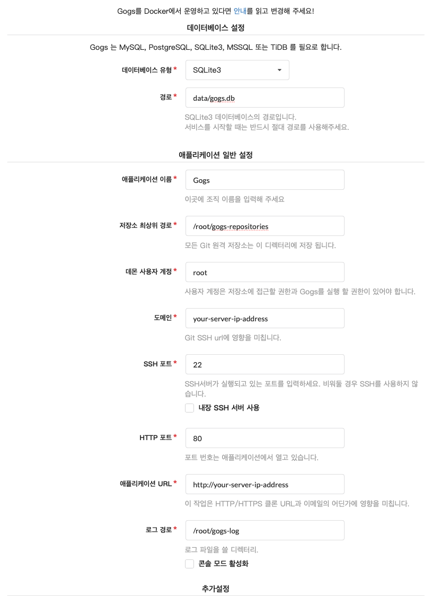

# Gogs
Gogs를 잘 사용하기 위해서는 CentOS 서버 하나가 필요합니다.

### 다운로드
Gogs설치를 위해 root 계정으로 접속합니다.
바이너리를 [다운로드](https://gogs.io/docs/installation/install_from_binary)하고 압축을 풀어 $HOME 디렉토리에 복사합니다.

### 설치
```bash
$ ./gogs web
```

http://localhost:3000 포트에서 설정을 진행합니다.
관리의 최소화를 목적으로 Gogs를 설치하고 있습니다. SQLite3을 선택하면 DB 셋팅할 것 도 없습니다.



### 실행
설치가 끝나면 `Ctrl + c`를 누르고 다시 아래 명령을 통해서 재시작을 진행합니다.

```bash
$ gogs web
```


### 디렉토리 구조
아래 폴더는 Gogs에서 중요하게 사용되는 경로입니다.

- /data: SQLite3 데이터가 저장되는 곳
- /gogs-repositories: 사용자의 모든 소스코드가 저장되는 곳

### 백업
gogs 서비스에서 백업하는 방법은 간단합니다.
cron에 등록하고 원하는 시간에 백업되도록 진행시키면 좋습니다.

```bash
$ gogs backup
```

명령어를 실행하면, 해당 경로에 gogs-backup-20190917082044.zip 파일이 생성됩니다.

### 회원가입
이슈, 버그트레킹툴이 가치 있으려면 모든 직원이 가입하고 사용하는 것을 추천합니다.
개발자를 포함하여 전직원 회원가입을 진행합니다.